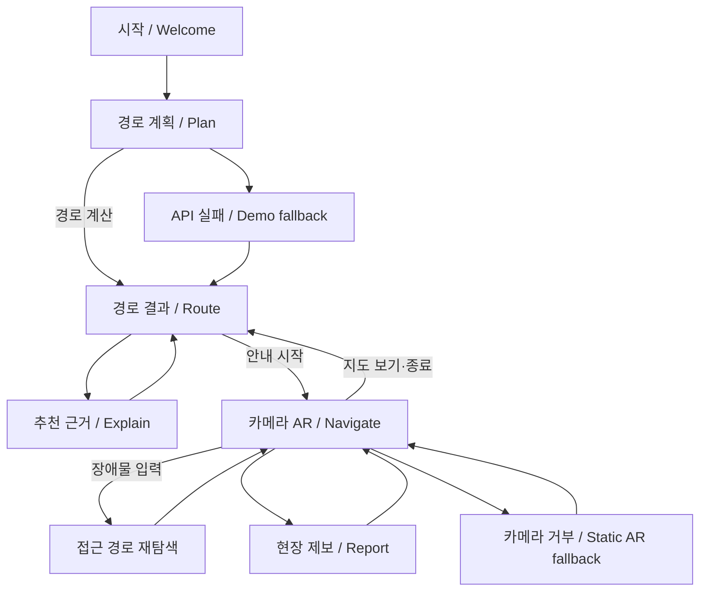

# NaVi 모바일 페이지 구조도

## 시민 흐름

## 화면별 구조

### 시작

`브랜드 심볼 → 서비스 약속 → 데이터 신뢰 원칙 → 시작하기`

### 경로 계획

`헤더·데이터 모드 → 출발/목적지 → 이동 조건 프리셋 → 적용 조건 → 길찾기 CTA`

### 경로 결과

`지도 → 경로 종류 토글 → 추천 경로 요약 → 미검증 고지 → 근거·설정 → AR CTA`

### 추천 근거

`뒤로가기 → 추천 이유 → 경로 차이 → 제외 구간 → 출처·검증 상태 → AR CTA`

### AR 안내

`카메라/대체 장면 → 다음 행동 → 인식·프로필 상태 → 프리즘 경로 → 재탐색 피드백 → 남은 거리 → 제어 도크`

### 현장 제보

`뒤로가기 → 검수 정책 → 유형 → 사진 → 메모 → 임시 저장 → 로컬 저장 완료`

### 관리자 검수

데스크톱은 `후보 대기열 + 근거·판정 패널`, 모바일은 `대기열 → 상세` 순서로 재배치한다.

## URL과 상태

- `/`는 단일 문서이며 `#/welcome`, `#/plan`, `#/route`, `#/explain`, `#/navigate`, `#/report`를 사용한다.
- route session ID는 `sessionStorage`에 저장한다.
- 제보 초안은 `localStorage`에 저장하며 공용 Graph 상태와 분리한다.
- `/review`는 기존 FastAPI 별도 진입점을 유지한다.
