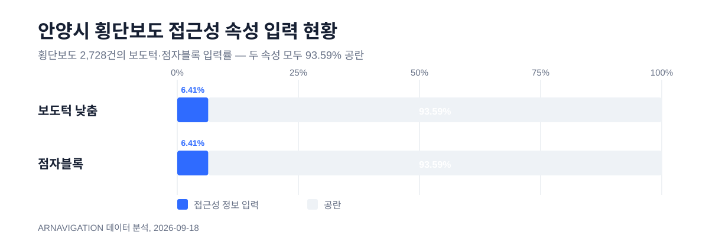
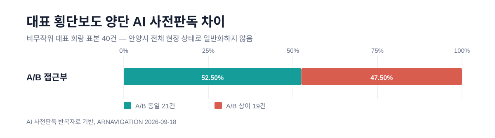
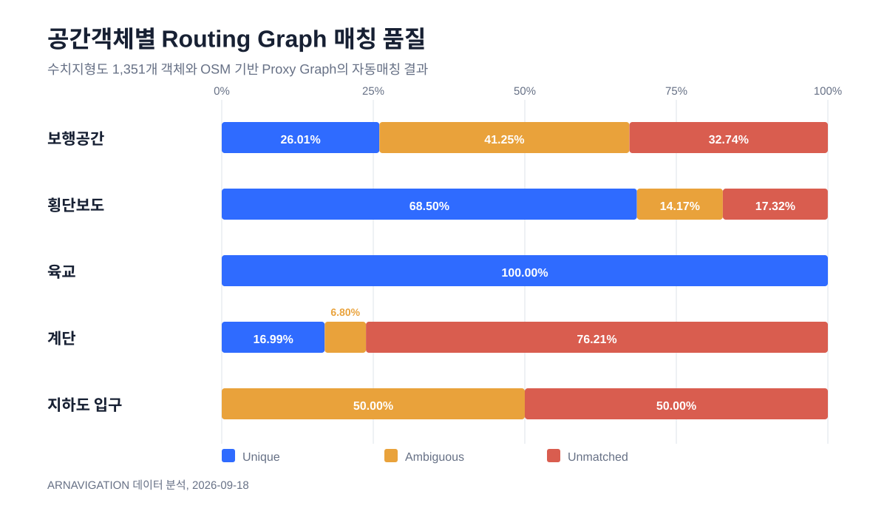
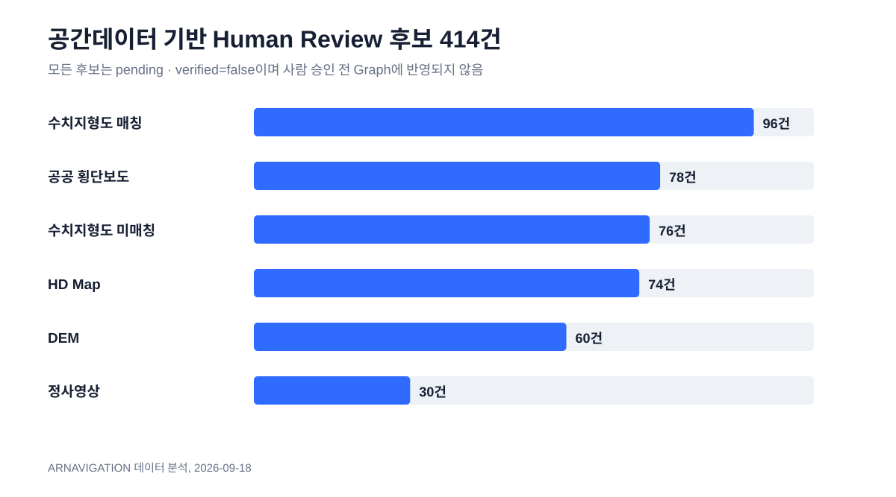
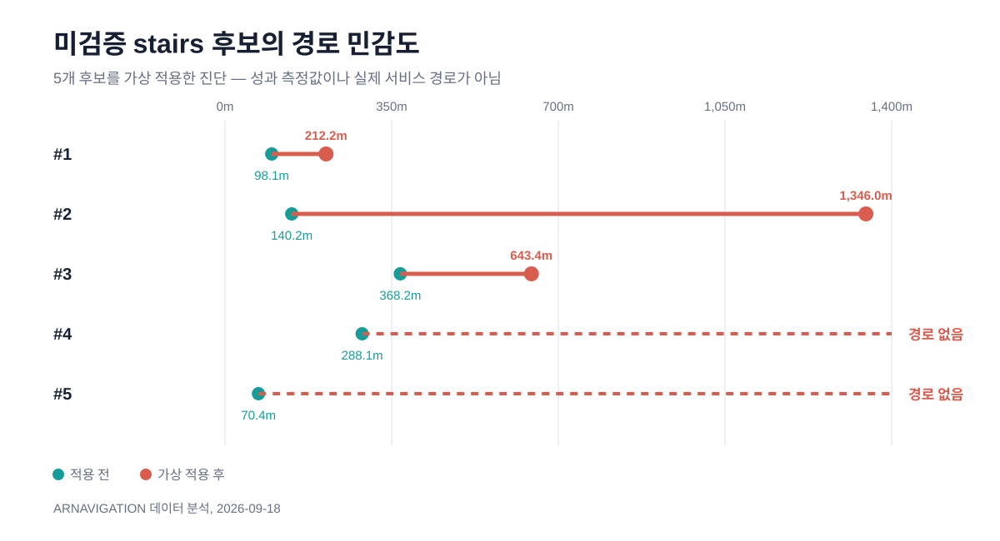
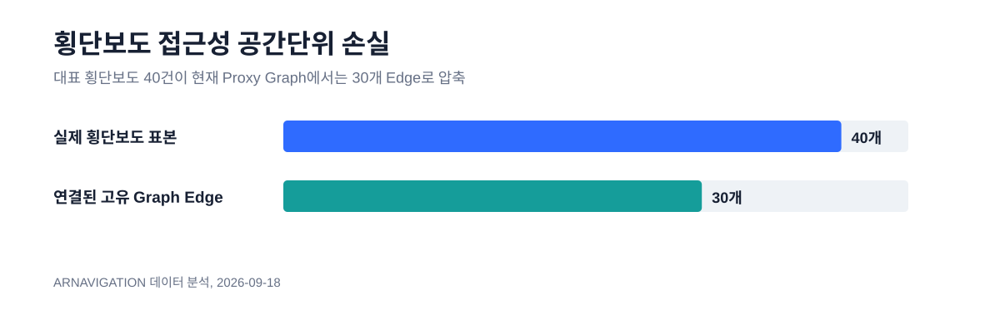
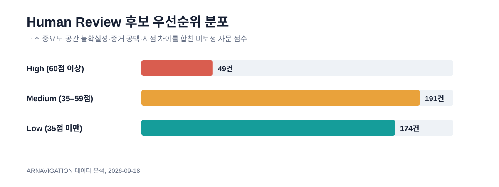
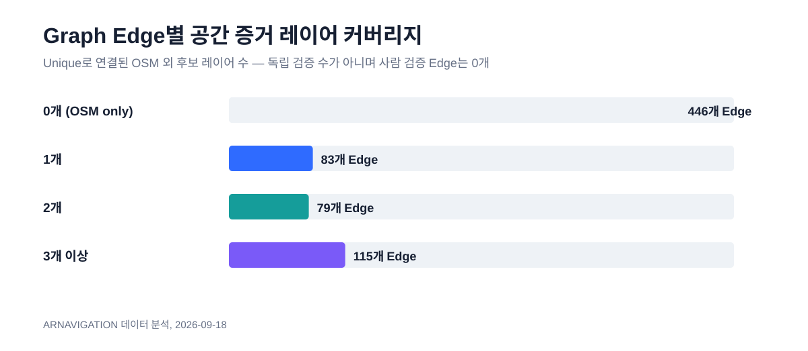

# ARNAVIGATION 보고서용 데이터 분석 패키지

> 기준일: 2026-09-18  
> 분석 범위: 현재 저장소의 공식 원자료와 파생 평가 산출물  
> 안전 경계: 후보·AI 판독·자동매칭 결과는 모두 미검증 파생자료이며 사람 승인 전 Graph에 반영하지 않음

## 한 문장 결론

공공 횡단보도 접근성 속성은 93.59%가 공란이고, 대표 회랑 표본에서는 양단 AI 사전판독이 47.5% 달랐으며, 수치지형도 객체의 자동 Unique Match는 28.87%에 그쳤다. 따라서 NaVi는 다중 공간자료에서 414개의 검수 후보를 만들되, 미승인 후보를 즉시 경로에 적용하지 않는 Human-in-the-loop 구조를 유지해야 한다.

## 보고서 핵심 논리선

1. 기존 공공데이터: 접근성 속성 93.59% 공란
2. 표현 단위: 대표 회랑 표본 40건 중 19건(47.5%)에서 A/B 사전판독 상이
3. 자동통합 한계: 수치지형도 1,351객체 중 Unique 390건(28.87%)
4. 검수 작업화: 6개 생성원에서 Human Review 후보 414건 구성
5. 승인 필요성: stairs 후보 5건 가상 적용 시 최대 +1,205.8m, 2건은 대체 경로 없음

## 1. 안양시 횡단보도 접근성 데이터 결측률

| 접근성 속성 | 입력 | 공란 | 입력률 | 공란률 |
|---|---:|---:|---:|---:|
| 보도턱 낮춤 | 175 | 2,553 | 6.41% | 93.59% |
| 점자블록 | 175 | 2,553 | 6.41% | 93.59% |



보고서 문장: 안양시 횡단보도 현황 2,728건을 분석한 결과, 보도턱 낮춤 여부와 점자블록 유무의 데이터 입력률은 각각 6.41%에 그쳤으며 93.59%는 공란으로 확인되었다. 기존 공공데이터만으로는 이동약자 경로판단에 필요한 세부 접근성 상태를 충분히 구성하기 어렵다.

## 2. 동일 횡단보도의 양단 접근부 차이

대표 회랑 횡단보도 40건을 A/B 접근부로 나눈 AI 사전판독 결과, 동일 21건과 상이 19건으로 상이 비율은 47.5%였다.



주의: 이는 비무작위 대표 회랑 표본의 AI 사전판독 결과다. 사람 Ground Truth가 아니므로 ‘안양시 횡단보도의 47.5%’로 일반화하거나 실제 시설 상태로 표현하면 안 된다.

## 3. 수치지형도 자동매칭

| 객체 | 전체 | Unique | Ambiguous | Unmatched |
|---|---:|---:|---:|---:|
| 보행공간 | 1,011 | 26.01% | 41.25% | 32.74% |
| 횡단보도 | 127 | 68.50% | 14.17% | 17.32% |
| 육교 | 5 | 100.00% | 0.00% | 0.00% |
| 계단 | 206 | 16.99% | 6.80% | 76.21% |
| 지하도 입구 | 2 | 0.00% | 50.00% | 50.00% |

전체 Unique Match는 390 / 1,351 = 28.87%다. 특히 계단 객체의 76.21%가 현재 Proxy Graph에 자동 대응되지 않았다.



## 4. Human Review 후보 414건

| 생성원 | 건수 |
|---|---:|
| 수치지형도 매칭 | 96 |
| 공공 횡단보도 | 78 |
| 수치지형도 미매칭 | 76 |
| HD Map | 74 |
| DEM | 60 |
| 정사영상 | 30 |
| 합계 | 414 |

Graph Edge ID가 연결된 후보는 325건(78.50%), 연결된 고유 Edge는 192개로 전체 723개 Edge의 26.56%다. 전 후보는 pending, verified=false, graph_update_allowed=false 상태다.



## 5. 미검증 속성의 경로 영향

| 후보 | 적용 전 | 가상 적용 후 | 영향 |
|---|---:|---:|---:|
| #1 | 98.1m | 212.2m | +114.1m |
| #2 | 140.2m | 1,346.0m | +1,205.8m |
| #3 | 368.2m | 643.4m | +275.2m |
| #4 | 288.1m | 경로 없음 | 단절 |
| #5 | 70.4m | 경로 없음 | 단절 |

현재 최신 시뮬레이션 파일에는 총 17건이 있으나, 이 중 12건은 90m DEM slope 진단 후보로 hard constraint 승인 대상이 아니다. 따라서 본문 Figure는 요청 범위이자 승인 가능 후보인 stairs 5건만 분리해 사용한다.



해석: 접근성 속성 하나를 잘못 hard constraint로 반영하면 큰 우회나 현재 Proxy Graph상의 단절을 만들 수 있다. 이 수치는 후보를 실제 Graph에 반영한 성과가 아니라, AI → Candidate → Human Review → 승인 후 반영 구조가 필요한 이유를 보여주는 가상 민감도다.

## 6. 추가 구조 분석

### 6.1 접근성 공간단위 손실

대표 횡단보도 40건은 실제 Graph에서 30개 Edge로 연결되어 10개 공간단위(25.0%)가 압축된다. 한 Edge에는 최대 4개 횡단보도가 연결된다.

Snap 거리는 중앙값 1.347m, 평균 2.482m, p95 8.813m, 최대 14.414m다. 대체로 위치는 가깝지만 시설 표현 단위가 손실되는 문제를 분리해서 봐야 한다.



### 6.2 횡단보도 Edge 제거 민감도

연결된 고유 Edge 30개 중 3개는 제거 후 양 끝 Node 간 대체 경로가 없었다(CW02, CW30, CW37). 나머지 27개의 대체경로/기존 Edge 길이 배율은 중앙값 2.75배, p90 4.75배, 최대 5.96배다.

| 표본 | 기존 Edge | 대체경로 | 배율 |
|---|---:|---:|---:|
| CW07 | 25.1m | 149.5m | 5.96배 |
| CW34 | 46.9m | 248.3m | 5.29배 |
| CW23 | 50.5m | 259.8m | 5.14배 |
| CW17 | 64.5m | 289.4m | 4.49배 |
| CW01, CW03 | 184.7m | 826.9m | 4.48배 |

표본 40건 중 Bridge Edge 위 횡단보도는 3건, Articulation Node 인접 횡단보도는 12건(30.0%)이다. 이는 현장 위험도가 아니라 현재 OSM 기반 Proxy Graph의 우회 연결 부족을 나타낸다.

### 6.3 검수 우선순위 점수

점수는 구조 중요도 40점, 공간 불확실성 30점, 증거 공백 20점, 자료 시점 차이 10점으로 구성했다. 아직 사람 검수 결과로 보정되지 않은 자문용 휴리스틱이며 후보의 사실성·위험도 점수가 아니다.

분포: High 49건, Medium 191건, Low 174건.



| 순위 | 후보 | 생성원 | 역할 | 점수 | 구조 | 공간 | 증거 | 시점 |
|---:|---|---|---|---:|---:|---:|---:|---:|
| 1 | RQ-2d466136652526a8d4a0 | topographic_map_unmatched | stairs_candidate | 93 | 40 | 30 | 20 | 3 |
| 2 | RQ-95039b28e054e12454e3 | topographic_map_unmatched | stairs_candidate | 93 | 40 | 30 | 20 | 3 |
| 3 | RQ-edd888a3d474beeb63ce | topographic_map_unmatched | stairs_candidate | 93 | 40 | 30 | 20 | 3 |
| 4 | RQ-e70bbe3a740ac8b30723 | topographic_map_unmatched | pedestrian_area | 91 | 40 | 28 | 20 | 3 |
| 5 | RQ-6dcf57a0a23e43c5c8ae | topographic_map | pedestrian_area | 86 | 40 | 16 | 20 | 10 |
| 6 | RQ-3f9de179b52895daa555 | topographic_map | pedestrian_area | 82 | 40 | 12 | 20 | 10 |
| 7 | RQ-d4c91a899507a2f9d96b | topographic_map | pedestrian_area | 82 | 40 | 12 | 20 | 10 |
| 8 | RQ-0bd11a3cbd09102371a0 | topographic_map_unmatched | pedestrian_area | 81 | 40 | 30 | 8 | 3 |
| 9 | RQ-722cf9c14d4247d26cd4 | topographic_map_unmatched | stairs_candidate | 81 | 40 | 30 | 8 | 3 |
| 10 | RQ-e7ec9f56ed0bc0852af3 | topographic_map_unmatched | stairs_candidate | 81 | 40 | 30 | 8 | 3 |

### 6.4 Cross-source 단순 Join 한계

HD Map coverage 내부 공공 횡단보도 210건 중 직접 근접 대응은 12건(5.7%), 주변 검토까지 포함하면 18건(8.6%)이다. 이는 HD Map 정확도가 낮다는 뜻이 아니라 서로 다른 객체 정의와 geometry 단위 때문에 단순 자동 Join이 어렵다는 뜻이다.

### 6.5 Edge별 증거 커버리지와 시점



커버리지는 OSM 외에 Unique로 연결된 공공 횡단보도·수치지형도·HD Map·정사영상 레이어 수다. 정사영상 후보는 공공 횡단보도 위치를 영상에 투영한 QA 단위이므로 독립 관측 확인으로 해석하지 않는다. 사람 검증 Edge는 현재 0개다.

자료 시점은 수치지형도 2022/2025, HD Map 2023, DEM·정사영상·로드뷰 2025, 공공 횡단보도·OSM 2026으로 섞여 있다. `table_06_evidence_coverage.csv`에 Edge별 시점 차이를 함께 기록했다.

### 6.6 AI 인식과 사용자 정책 분리

기존 AI block 후보 5건 중 tactile_absent_candidate가 4건(80.0%)이다. 현 wheelchair hard constraint에는 점자블록 부재가 포함되지 않는다. 따라서 ‘점자블록이 보이지 않음’이라는 perception 결과와 사용자 프로필별 routing policy를 분리해야 한다.

## 7. 보조 검증 결과

- Validation Check: Pass 176, Warning 7, Hold 1, Fail 0
- 평가 전후 Graph SHA-256 동일: true
- DEM: 596 / 723 Edge(82.43%)가 3개 미만 Cell, 동일 90m Cell 241개, hard constraint 사용 가능 Edge 0개
- 결론: 90m DEM은 도시 보행 Edge의 개별 경사를 hard constraint로 쓰기에 해상도가 부족하다.

## 8. Figure 설명문

1. Figure 1 — 안양시 횡단보도 2,728건의 보도턱·점자블록 속성 입력률. 두 속성 모두 93.59%가 공란이다.
2. Figure 2 — 대표 회랑 횡단보도 40건의 A/B 접근부 AI 사전판독 비교. 19건(47.5%)에서 결과 차이가 관찰되었다.
3. Figure 3 — 수치지형도 공간객체와 OSM 기반 Proxy Graph의 매칭 결과. 계단 등 접근성 핵심 객체에서 자동매칭 한계가 두드러진다.
4. Figure 4 — 서로 다른 공간자료에서 자동 추출한 Human Review 후보 414건의 구성. 모든 후보는 사람 검증 전까지 Graph에 반영되지 않는다.
5. Figure 5 — 미승인 stairs 후보 5건을 가상 적용한 경로 민감도. 최대 +1,205.8m와 2건의 대체경로 부재가 나타났으나 성과 측정값은 아니다.
6. Figure 6 — 대표 횡단보도 40건이 현재 Proxy Graph에서 30개 Edge로 압축되는 접근성 공간단위 손실.
7. Figure 7 — 723개 Edge별 OSM 외 후보 증거 레이어 연결 수. 레이어 수는 사람 검증 또는 독립 확인 수와 다르다.
8. Figure 8 — 414개 검수 후보의 미보정 자문용 우선순위 분포. 현장검수 결과가 쌓이면 가중치와 구간을 재보정해야 한다.

## 9. 산출물과 재현

```powershell
.\.venv\Scripts\python.exe -X utf8 scripts\build_report_analysis_package.py
```

- 요약: `artifacts/report-analysis-20260918/analysis_summary.json`
- 우선순위 전체: `artifacts/report-analysis-20260918/table_05_review_priority_414.csv`
- Edge 증거/시점: `artifacts/report-analysis-20260918/table_06_evidence_coverage.csv`
- 입력 체크섬: `artifacts/report-analysis-20260918/input_manifest.csv`

이 분석 과정은 원자료와 공용 Graph를 수정하지 않았으며, 실행 전후 Graph SHA-256이 동일하다.
